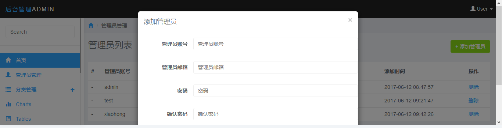
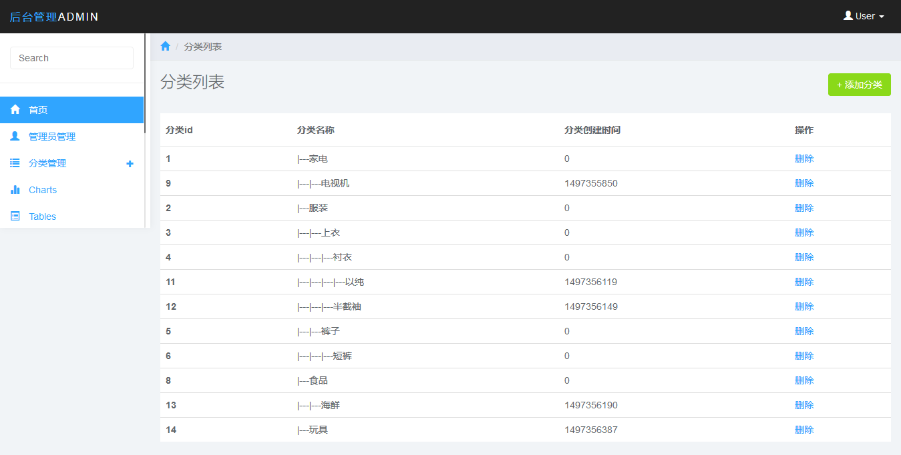

YII后台模板

# 实现功能如下

- 管理员登录
- 找回密码（通过发邮件的方式）
- 管理员管理（包括添加，删除）
- 无限极分类管理（添加，删除）

# 配置： 

## 收发邮件

在 config/web.php 中

```
'mailer' => [
            'class' => 'yii\swiftmailer\Mailer',
            // send all mails to a file by default. You have to set
            // 'useFileTransport' to false and configure a transport
            // for the mailer to send real emails.
            'useFileTransport' => false,
			'transport'=>[
				'class' => 'Swift_SmtpTransport',
                'host' => 'smtp.163.com',
                'username' => '*****@163.com',
                'password' => '******',
                'port' => 25,
			],
        ],
```

修改邮箱的账号密码和相应配置

在 config/params.php 中

```
'mailer'=>'******@163.com',
```

改成和上述一样的账号。

## 管理员列表分页数目

在 config/params.php 中，默认为7条

```
'adminlist_pagesize'=>7,
```

# 实现效果如下几幅图所示

## 登录页面


## 找回密码


## 管理员管理



## 分类管理


